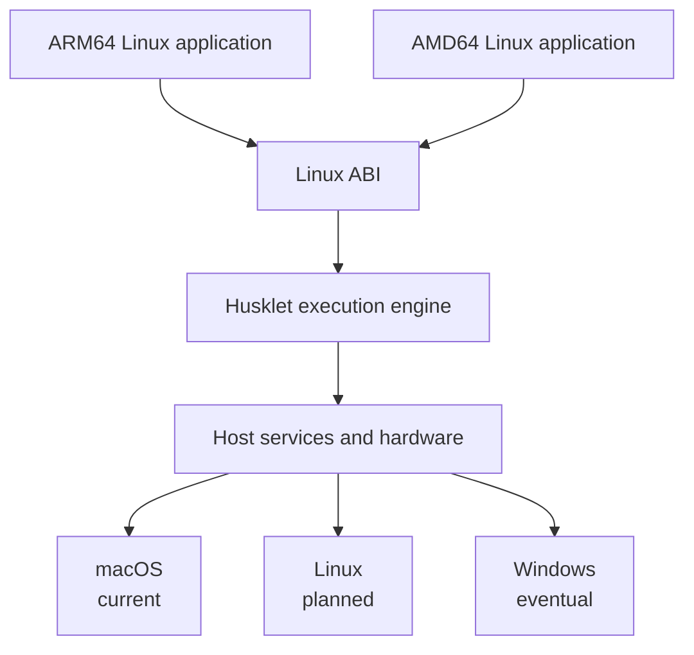

  

  <h1>Husklet</h1>

  
Isolated, reproducible Linux workspaces.

  

    
    
    
    
  

Husklet is an early-stage workspace application for isolated, reproducible Linux development environments.
Each workspace combines a configured image, terminal, containers, networking, and project settings without
installing project tools on the host. The goal is a practical environment for everyday development, including
VPNs, graphical tools, and deeper workspace integrations.

## Workspaces

Every project and serious development often need runtimes that can conflict (libraries, system services, drivers and others). Husklet keeps those requirements inside a workspace while providing the terminal and controls needed to work with them. Workspace images are intended to make common projects useful immediately and reproducible across machines.

In age of agents this work is even more important as you do not want agents to modify your host, leak env or tamper with system.

## Containers

Husklet is building lightweight Linux containers as an alternative to running a full virtual machine for
each environment. Linux system calls cross an ABI boundary into the host instead of booting a separate guest
kernel.

The workspace sees Linux while Husklet translates execution, files, networking, and devices onto the host.
This avoids the memory and startup cost of one complete virtual machine per workspace. macOS is the current
host target; Linux and Windows are later portability goals.

## Docker

Husklet exposes a shared Docker-compatible API. Docker clients on the host can inspect and control containers
across workspaces without entering a workspace first. Compatibility is under active development.

## Checkpointing

The engine controls Linux process execution, which makes saving process state and later restoring running
commands possible. Husklet is integrating this into “continue later” workspace sessions; complete,
failure-safe restoration remains in development.

## GPU and GUI applications

The virtual GPU lowers guest GL, Vulkan, and CUDA operations into an intermediate representation for
execution on host hardware. Together with Wayland and host surfaces, this is intended to let gui apps (editors,
browsers etc) and their supporting tools run inside the same isolated workspace. GPU and GUI compatibility is
still being expanded and hardened.

## Terminal

Husklet includes a terminal attached directly to each workspace. The target is a responsive, native-feeling
terminal with reliable session restoration.

## Contact

Richard Hutta — huttarichard@gmail.com
