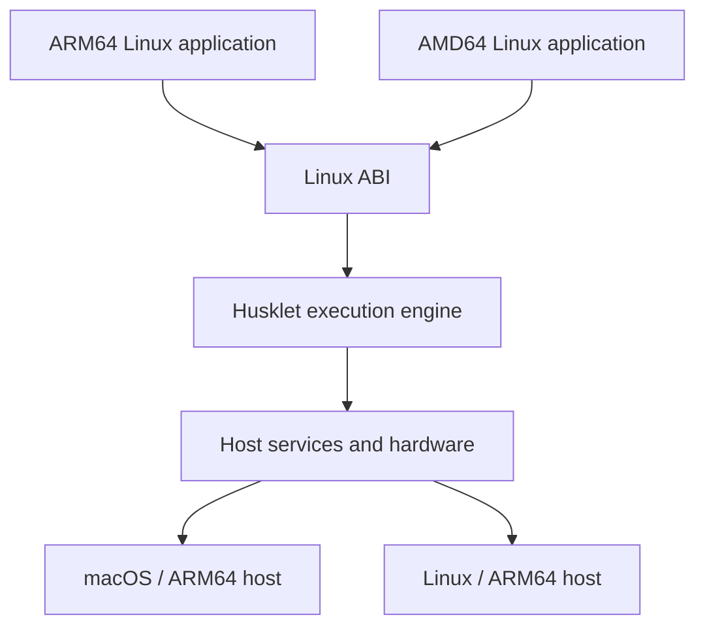

  

  <h1>Husklet</h1>

  
Isolated, reproducible Linux workspaces.

  

    
    
    
    
  

Husklet is an early-stage workspace application for isolated, reproducible Linux development environments.
Each workspace combines a configured image, terminal, containers, networking, and project settings without
installing project tools on the host. The goal is a practical environment for everyday development, including
networking, terminals, and deeper workspace integrations.

## Workspaces

Every project and serious development often need runtimes that can conflict (libraries, system services, drivers and others). Husklet keeps those requirements inside a workspace while providing the terminal and controls needed to work with them. Workspace images are intended to make common projects useful immediately and reproducible across machines.

In age of agents this work is even more important as you do not want agents to modify your host, leak env or tamper with system.

## Containers

Husklet is building lightweight Linux containers as an alternative to running a full virtual machine for
each environment. Linux system calls cross an ABI boundary into the host instead of booting a separate guest
kernel.

The workspace sees Linux while Husklet translates execution, files, networking, and devices onto the host.
This avoids the memory and startup cost of one complete virtual machine per workspace. The embedded C engine
currently builds on macOS/ARM64 and Linux/ARM64 and runs both ARM64 and AMD64 Linux guests.

## Docker

Husklet exposes a shared Docker-compatible API. Docker clients on the host can inspect and control containers
across workspaces without entering a workspace first. Compatibility is under active development.

## Checkpointing

The engine controls Linux process execution, which makes saving process state and later restoring running
commands possible. Husklet is integrating this into “continue later” workspace sessions; complete,
failure-safe restoration remains in development.

## Terminal

Husklet includes a terminal attached directly to each workspace. The target is a responsive, native-feeling
terminal with reliable session restoration.

## Development

The pinned Nix flake supplies the Rust, C, GTK, and fixture toolchain. Build the
two production engine workers with
`nix develop . --command cargo build --release -p engine --bins --locked --offline`;
the C engine source lives only
under `src/runtime/native` and is linked into `hl-aarch64` and `hl-x86_64`.
Rust remains the product host: it validates launch plans, supervises workers,
and owns the container, filesystem, networking, image, daemon, and application
services around the in-process C Linux ABI and translator. Neither build nor
runtime reads `../engine` or `../engine_rust`.

On Linux, verify a worker built by Cargo with
`target/release/hl-aarch64 --backend-receipt` or
`target/release/hl-x86_64 --backend-receipt`. A successful JSON receipt names the
`retained-c` backend and hashes the worker that actually performed selection;
it is not a compatibility or performance result.

Run `nix flake check -L` for the complete pinned repository gate, including
Rust and C compilation, formatting, static analysis, repository policy, and
tests. Direct Cargo commands remain the primary build and test interface; Nix
provides the pinned compilers, analyzers, system libraries, and release tooling.

ELF inspection and the main-image placement plan are generic for `ET_EXEC` and
`ET_DYN` (PIE and static PIE), and both workers consume that typed plan. When an
`ET_EXEC` image cannot occupy its link address, the shared projection keeps
guest-visible PCs and pointers in canonical low coordinates while translating
accesses to displaced storage. The permanent forced-displacement fixture proves
a nonzero storage bias while exercising PC identity, static data and pointers,
direct calls, indirect calls, and syscall output on both guest ISAs. Production
C no longer inspects Go metadata or V8 symbols to make that path work.

Performance work uses `tests/bench/eri_matrix.py` to compare the external C
oracle, explicit C selection, and the integrated product default with immutable
artifacts, null arms, exact output, and unique resumable ledgers. Historical
Rust-vs-C records are not current product baselines.

## Contact

Richard Hutta — huttarichard@gmail.com
