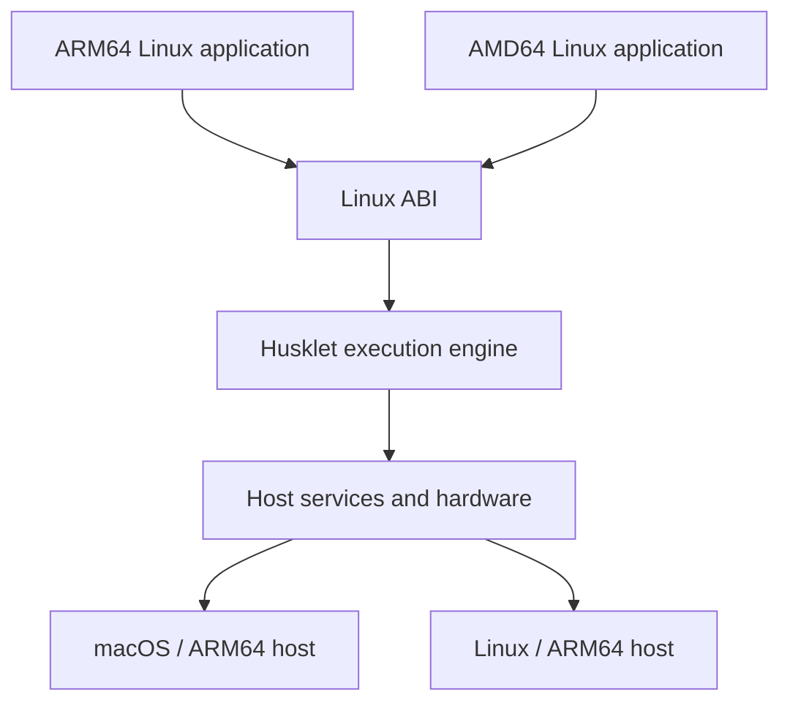

  

  <h1>Husklet</h1>

  
Isolated, reproducible Linux workspaces.

  

    
    
    
    
  

Husklet is an early-stage workspace application for isolated, reproducible Linux development environments.
Each workspace combines a configured image, terminal, containers, networking, and project settings without
installing project tools on the host. The goal is a practical environment for everyday development, including
networking, terminals, and deeper workspace integrations.

## Workspaces

Every project and serious development often need runtimes that can conflict (libraries, system services, drivers and others). Husklet keeps those requirements inside a workspace while providing the terminal and controls needed to work with them. Workspace images are intended to make common projects useful immediately and reproducible across machines.

In age of agents this work is even more important as you do not want agents to modify your host, leak env or tamper with system.

## Containers

Husklet is building lightweight Linux containers as an alternative to running a full virtual machine for
each environment. Linux system calls cross an ABI boundary into the host instead of booting a separate guest
kernel.

The workspace sees Linux while Husklet translates execution, files, networking, and devices onto the host.
This avoids the memory and startup cost of one complete virtual machine per workspace. macOS is the current
host targets currently covered by the C engine are macOS/ARM64 and Linux/ARM64.

## Docker

Husklet exposes a shared Docker-compatible API. Docker clients on the host can inspect and control containers
across workspaces without entering a workspace first. Compatibility is under active development.

## Checkpointing

The engine controls Linux process execution, which makes saving process state and later restoring running
commands possible. Husklet is integrating this into “continue later” workspace sessions; complete,
failure-safe restoration remains in development.

## Terminal

Husklet includes a terminal attached directly to each workspace. The target is a responsive, native-feeling
terminal with reliable session restoration.

## Development

The pinned Nix flake supplies the Rust, C, GTK, and fixture toolchain. Build the
two production engine workers with `make engine`; the C engine source lives only
under `src/runtime/native` and is linked into `hl-aarch64` and `hl-x86_64`.
Run `make lint-c` for its inventory, format, analysis, and warning-strict checks,
and `make gate` for the complete headless repository gate. `make gate-fixture`
is optional and requires the documented Alpine fixture and a static-capable host
C compiler.

Performance work uses `make bench-product-ab-prepare PRODUCT_AB_RUN=<new-id>`
followed by `make bench-product-ab PRODUCT_AB_RUN=<same-id>`. The harness refuses
reused artifact directories and results paths. Historical Rust-vs-C benchmark
records are not current product baselines.

## Contact

Richard Hutta — huttarichard@gmail.com
